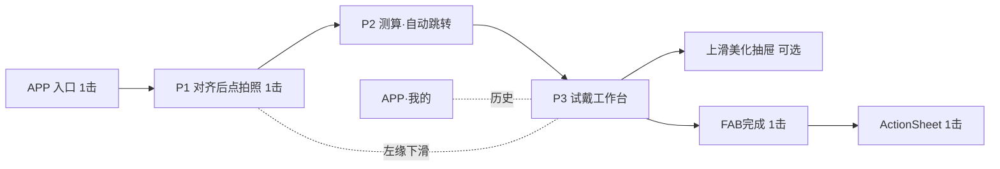

# 开心玉米 AI 试戴 · 分页框线设计图

**版本**：2.1.1（低点击优化 · 拍照需手动确认）  
**画布**：移动端竖屏 · 375×812（逻辑 px，uni-app 安全区适配）  
**品牌色**：品牌蓝 `#1A6DFF` · 品牌橙 `#FF6B00` · 成功绿 `#22C55E` · 预警黄 `#EAB308` · 不适配红 `#EF4444`

**交互原则**：能自动则自动；能滑动则滑动；能合并则合并；**拍照须用户点击确认**（达标后方可点）；主路径 **≤6 次点击** 完成「拍照 → 试戴 → 加购/分享」。

---

## 0. 流程总览（低点击版）



### 页面收敛（11 屏 → 3 主屏 + 2 浮层）

| 页码 | 页面 | 用户点击 | 说明 |
|------|------|----------|------|
| — | APP 入口 | **1** | 唯一入口点击 |
| **P1** | 拍照对齐 | **1** | 达标后点「拍照」→ 同屏 3 秒倒计时自动快门 |
| **P2** | 测算加载 | **0** | 自动进入试戴 |
| **P3** | 试戴工作台 | **1～3** | 横滑换款 0 击；完成 1 击；加购/分享再 1 击 |
| **浮层 A** | 美化抽屉（美颜/发型/场景 Tab） | **0～2** | 可选；点选即生效，无「下一步」 |
| **浮层 B** | 完成 ActionSheet | **1** | 收藏/加购/保存/分享 |
| — | 我的记录 | — | 仅 APP「我的」进入，不占主路径 |

### 主路径点击预算

| 阶段 | 操作 | 点击数 |
|------|------|--------|
| 进入试戴 | APP 入口 | 1 |
| 拍照 | 点「拍照」→ 同屏倒计时→自动快门 | 1 |
| 测算 | 自动跳转 | 0 |
| 试戴 | 默认已戴推荐第 1 款；横滑换款 | 0 |
| 结束 | 点 FAB「完成」→ 点「加购物车」等 | 2 |
| **合计（最短路径）** | | **4** |

增强能力（美颜/发型/场景）为 **可选**，上滑抽屉点选即应用，不增加页面跳转。

---

## 设计规范（框线通用）

| 元素 | 规格 |
|------|------|
| 顶栏 | 极简：仅 ◀ 关闭；**无**标题栏占屏（面宽信息并入 P3 顶条） |
| 主按钮 | **P1「拍照」**、**P3 FAB「完成」** 为品牌蓝实心；其余能省则省 |
| 禁止 | 主路径上的「下一步」「应用」「查看推荐」等二次确认按钮 |
| 手势 | 横滑换款 · 上滑美化抽屉 · 左缘右滑关闭试戴 |
| 适配标签 | 绿 / 黄 / 红，贴在款式缩略图上，不单独弹说明 |

---

## P1 · 拍照对齐（点击拍照 + 同屏倒计时）

**目标**：用户 **主动点击** 开始拍摄；倒计时仍在同屏完成，不跳转独立页。

**状态机**：`aligning` → `ready`（绿框+震动+按钮可点）→ 用户点「拍照」→ `countdown`（同屏 3→2→1）→ `capture` → 上传

```
┌──────────────────────────────────────┐
│ ◀                                    │
├──────────────────────────────────────┤
│                                      │
│     ╭──────────────╮                 │
│     │  人脸对齐框   │  蓝→绿          │
│     ╰──────────────╯                 │
│            ●                         │  ← 达标橙点
│                                      │
│  ┌────────────────────────────────┐  │
│  │ 请保持正面，对准后点击下方拍摄    │  │
│  └────────────────────────────────┘  │
│     · 脸请摆正  · 请靠近一点          │
│                                      │
│            ┌──────────────┐          │
│            │   拍 照      │          │  ← 品牌蓝；仅 ready 时可点
│            └──────────────┘          │     aligning 时灰显不可点
│                                      │
│         点击后同屏叠加倒计时：          │
│              ╭ 3 ╮  橙字              │  ← 不跳页；期间按钮隐藏
│                                      │
└──────────────────────────────────────┘
```

| 规则 | 说明 |
|------|------|
| 未达标 | 对齐框蓝色，「拍照」按钮 **禁用**（灰显） |
| 达标 | 框变绿 + 震动 + 橙点；「拍照」 **可点**（仍需用户确认） |
| 点拍照 | 同屏开始 3 秒倒计时（橙字 3→2→1），结束后自动快门 |
| 倒计时 | **不提供**「立即拍摄」——避免多一次点击；用户已点过拍照 |
| 重拍 | 测算失败或用户主动退出后回到 P1；抓拍失败自动重试 1 次 |

**相对 v2.0 减少**：仅去掉 **独立倒计时页**（仍为 1 次「拍照」点击 + 同屏倒计时）。

---

## P2 · 测算加载（纯过渡）

**目标**：0 点击；测算与拉取推荐款 **并行**；完成后 **自动** 进入 P3。

```
┌──────────────────────────────────────┐
│                                      │
│              ◠◡◠  + 橙点环           │
│         毫米级精准测算中               │
│    正在为您匹配镜框…                  │  ← 合并「测算+推荐」文案
│                                      │
│         （无按钮、不可跳过）           │
└──────────────────────────────────────┘
```

| 规则 | 说明 |
|------|------|
| 并行 | 面宽测算 + Top3 推荐款 3D 预加载同时进行 |
| 完成 | 直接替换为 **P3**，第一款试戴图已渲染好 |

**相对 v2.0 减少**：取消 P4 结果卡（省 1 击「查看推荐」）、取消 P5 列表页（省列表点击 1 击+）。

---

## P3 · 试戴工作台（核心一屏）

**目标**：测算后 **一屏到底**——面宽条 + 3D 试戴 + 横滑换款 + FAB 完成；列表/结果/试戴三合一。

```
┌──────────────────────────────────────┐
│ ◀   面宽 53mm · 精准适配 ▾          │  ← 顶条可点击 ▾ 展开详情（可选，默认收起）
├──────────────────────────────────────┤
│                                      │
│     ┌────────────────────────┐       │
│     │  实拍 + 3D 镜框         │       │  ← 左右滑 → 换款（0 点击）
│     │  默认已戴 Top1          │       │     淡入淡出 + 轻音效
│     └────────────────────────┘       │
│  ┌────────────────────────────────┐  │
│  │ ● 精准适配 · 面宽完美匹配       │  │  ← 随款式自动更新
│  └────────────────────────────────┘  │
│                                      │
│  ◀ [■精准][■精准][■勉强][■…] ▶     │  ← 横滑条=原推荐列表；当前款高亮
│                                      │     点击缩略图=同滑动手势（可点可滑）
│                          ┌────┐      │
│                          │完成│      │  ← FAB 品牌蓝，固定右下
│                          └────┘      │
│  ───────── 上滑美化 ─────────         │  ← 提示条，首次弱引导
└──────────────────────────────────────┘
```

### P3 顶条展开（非独立页，点击 ▾ 1 次）

```
┌──────────────────────────────────────┐
│  面宽 53mm  脸型椭圆  推荐 51–55mm    │  ← 下拉面板，点空白收起
│  镜片×2+中梁换算                      │
└──────────────────────────────────────┘
```

### P3 交互一览

| 操作 | 点击 | 行为 |
|------|------|------|
| 换款 | 0 | 横滑预览区或底栏缩略图 |
| 看测算详情 | 0～1 | 默认收起；点 ▾ 展开，再点空白收起 |
| 收藏 | 0 | **长按**当前预览 → Toast「已收藏」（或双击预览） |
| 美化 | 0～1 | **上滑**打开浮层 A；不滑则跳过美颜/发型/场景 |
| 完成 | 1 | 点 FAB → 浮层 B |
| 退出 | 1 | ◀ 关闭（确认仅在有编辑时弹出，默认直接退） |

**相对 v2.0 减少**：P5 列表、P6 试戴合并；去掉底栏「换一款」「满意去美化」2～3 击；分享/收藏移出顶栏，改为手势与完成页。

---

## 浮层 A · 美化抽屉（美颜 / 发型 / 场景）

**目标**：不跳页、无「应用」「下一步」；**点选即生效**，默认已套推荐参数。

```
┌──────────────────────────────────────┐
│  （P3 预览半透明压暗）                  │
├──────────────────────────────────────┤
│  ———— 下拉把手 ————                   │
│  [ 美颜 ] [ 发型 ] [ 场景 ]            │  ← Tab 切换，0 次跳转
│                                      │
│  Tab·美颜：  关 | 自然● | 提亮        │  ← 分段器，点选即渲染
│  Tab·发型：  [推][推][推][推] 横滑      │  ← 点缩略图即换发型
│  Tab·场景：  商务 户外 校园 … chips     │  ← 点 chip 即换背景
│                                      │
│         （无底部主按钮）               │
│  下滑关闭抽屉 → 回到 P3               │
└──────────────────────────────────────┘
```

| 规则 | 说明 |
|------|------|
| 默认 | 进入抽屉时 **美颜=自然** 已开启（试戴满意后的增强，不回头改面宽） |
| 发型 | 进入 Tab 时 **自动套推荐发型 1 款**，用户仅需横滑替换 |
| 场景 | 默认「原背景」；点 chip 切换，**无「生成预览」按钮** |
| 关闭 | 下滑把手或点遮罩 → 回 P3，状态保留 |

**相对 v2.0 减少**：P7/P8/P9 三页及其中 6+ 按钮（应用、下一步、生成预览等）。

---

## 浮层 B · 完成 ActionSheet

**目标**：FAB 一次点开；常用动作 **各 1 击**，不另开 P10 全屏。

```
┌──────────────────────────────────────┐
│  （P3 预览 + 当前效果）                │
├──────────────────────────────────────┤
│  ─── 完成试戴 ───                     │
│  🛒  加入购物车          → 商品详情    │
│  ♡  收藏                 → Toast      │
│  ↓  保存到相册（有水印）               │
│  ↓  保存高清（无水印）     橙字强调     │
│  ↗  分享到朋友圈                       │
│  ─────────────────                   │
│  重新测脸                              │  ← 次要，置底
│  取消                                  │
└──────────────────────────────────────┘
```

| 规则 | 说明 |
|------|------|
| 保存 | 点即下载，**无**二次格式选择页 |
| 分享 | 调起系统/APP 分享面板，**无**中间页 |
| 加购 | 直跳 SKU 详情（带当前试戴图参数可选） |

**相对 v2.0 减少**：取消 P10 独立页；下载/分享从多按钮全屏改为 Sheet 一次展开。

---

## 我的记录（非主路径）

仅从 APP「我的」进入；列表项 **单击** 恢复 P3 状态（带历史款+图），不再提供「再编辑」二次入口。

```
┌──────────────────────────────────────┐
│ ◀  试戴记录                           │
├──────────────────────────────────────┤
│ ┌──────┬──────────────────────────┐  │
│ │ thumb│ 5/18 · A-2024 · 53mm      │  │  ← 整行一点 → P3
│ └──────┴──────────────────────────┘  │
│         重新测脸（底部文字链 1 击）     │  ← → P1
└──────────────────────────────────────┘
```

---

## 分屏说明（评审用）

| 对照 | 左 | 右 |
|------|----|----|
| 拍照 | 蓝框 aligning | 绿框+同屏倒计时 |
| 路径长度 | v2.0 主路径 ~10 击 | v2.1 主路径 **4 击** |
| 拍照 | 达标自动快门 | **达标后点拍照 1 击** + 同屏倒计时 |
| 增强 | 三页分步 P7–P9 | 单抽屉 Tab |

---

## 废弃 / 合并对照（v2.0 → v2.1）

| 原页面 | 处理 |
|--------|------|
| P2 倒计时独立页 | 并入 P1（点拍照后同屏倒计时，仍须用户先点 1 次） |
| P4 测算结果卡 | 并入 P3 顶条（默认收起） |
| P5 推荐列表 | 并入 P3 底栏横滑 |
| P6 试戴页 | 与 P5 合并为 **P3** |
| P7–P9 美颜/发型/场景 | 合并为 **浮层 A** |
| P10 分享下载页 | 合并为 **浮层 B** |
| P11 我的记录 | 保留，仅 APP 侧入口 |

---

## 附录：与功能清单步骤映射

| 功能清单步骤 | 框线 |
|--------------|------|
| 步骤一～二 入口与拍照对齐 | APP 入口 + **P1**（点拍照 + 同屏倒计时） |
| 步骤三 AI 测算与推荐 | **P2**（自动）+ **P3** 顶条/底栏 |
| 步骤四 3D 试戴 | **P3** 主预览区 |
| 步骤五～七 美颜/发型/场景 | **浮层 A**（可选） |
| 步骤八 收藏下单分享 | **浮层 B** + APP 我的记录 |

---

## 开发路由建议（收敛后）

| 路由 | 说明 |
|------|------|
| `pages/tryon/capture` | P1 |
| `pages/tryon/analyzing` | P2（可无历史栈，replace 到 workspace） |
| `pages/tryon/workspace` | P3 + 浮层 A/B 同路由组件 |

**文档维护**：UI 高保真以 **P1 / P2 / P3 + 两浮层** 为准；新增全屏页需评审「是否增加必点次数」。
