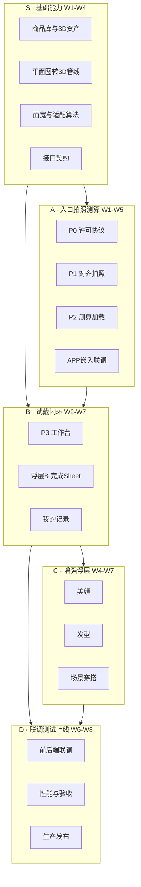
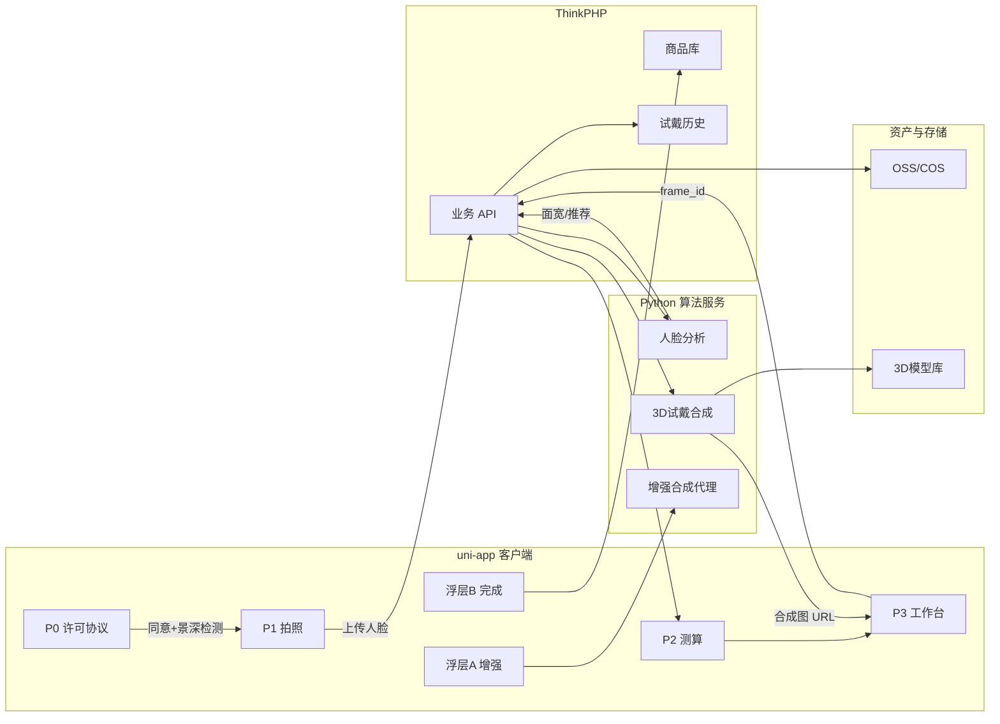
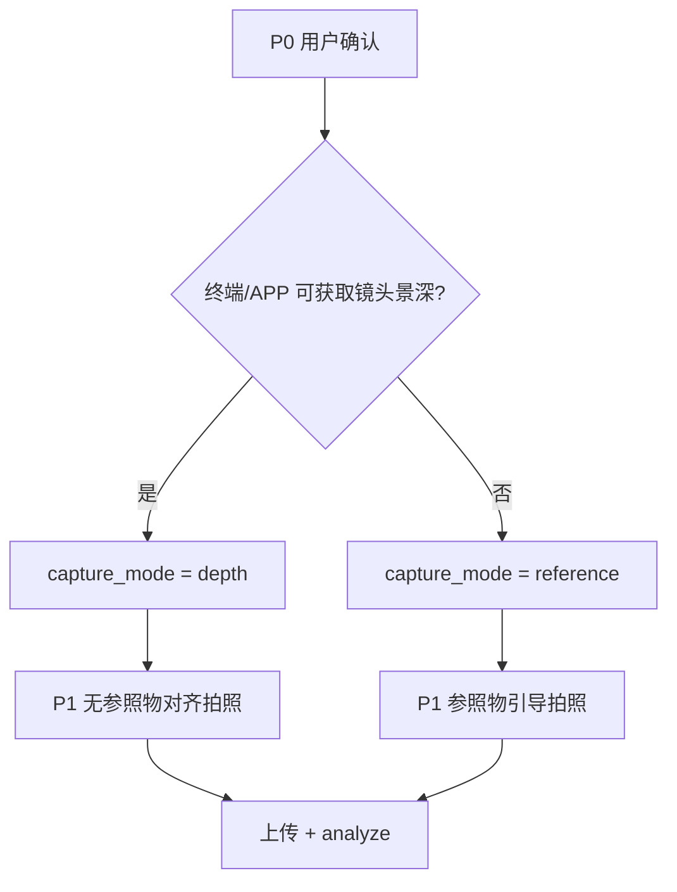

# 开心玉米 AI 试戴系统 · 研发设计说明书

**版本**：1.1  
**日期**：2026-05-29  
**v1.1 修订**：恢复页面二「用户许可协议」独立页（P0）；明确无镜头景深能力时须使用参照物拍照。
**文档性质**：任务划分、技术选型、基本设计、需求/设计/测试用例（供研发、测试、联调与验收对齐）  
**依据文档**（优先级由高到低）：

| 序号 | 文档 | 说明 |
|------|------|------|
| 1 | 《开心玉米 AI 试戴系统流程说明书（文字版）(5).docx》 | **用户确认**的最新业务需求 |
| 2 | 《开心玉米 AI 试戴系统功能清单 v2.0》 | 需求对齐会冻结版 |
| 3 | 《分页框线设计图 v2.1.1》 | 低点击交互与页面合并精简 |
| 4 | 《工作安排 v2.0》 | 工作包、排期、分工 |
| 5 | 本仓库 `glasses_tryon_mvp.md` / 现有 Demo | 技术验证与接口雏形 |

---

## 0. 需求基线与实现方案说明

用户确认的《流程说明书》描述 **11 个功能页面** 的完整体验闭环；经需求对齐会与框线评审后，在**不削弱核心业务目标**的前提下，对页面与交互做如下**合并精简**（详见框线 v2.1.1）：

| 用户确认流程（说明书） | 1.0 实现方案（框线） | 业务意图保留情况 |
|------------------------|----------------------|------------------|
| 页面二：权限许可引导页 | **保留独立页 P0**；协议全文 + 滑到底才可确认；后台并行申请权限 | 未读不可同意；确认后直达拍照 |
| 页面三：实拍（备注三·景深） | **条件分支**：有景深 → 无参照物实拍；**无景深 → 须持参照物拍摄** | 与说明书备注三一致 |
| 页面四：面部精准数据展示页 | **并入 P3 顶条**（默认收起，▾ 展开详情） | 面宽、脸型等数据仍可查看与保存 |
| 页面五 + 列表：试戴主界面 | **合并为 P3 试戴工作台**（预览 + 底栏横滑列表） | 分类推荐、适配标签、商品信息、加购保留 |
| 页面六：多镜框对比（2～9 款） | **1.0 主路径以横滑单款对比**；多宫格对比列为 **1.1 候选** | 说明书能力可在后续版本恢复 |
| 页面七～九：美颜 / 发型 / 场景分步页 | **合并为浮层 A**（上滑抽屉 Tab，点选即生效） | 先试戴后美颜；三类增强均纳入 1.0 |
| 保存 / 分享 / 加购 | **浮层 B ActionSheet**（FAB「完成」唤起） | 闭环动作完整保留 |

**1.0 交付形态**：APP 内嵌模块 · **4 主屏（P0/P1/P2/P3）+ 2 浮层（A/B）** · 主路径约 **5 次点击**（含协议确认 1 击）。

> **与框线 v2.1.1 的差异**：框线方案曾省略独立同意书；**以用户最新确认为准**，页面二恢复为 P0，并在 §4 补充景深/参照物分支设计。

---

## 1. 项目目标与范围

### 1.1 业务目标

完成「**APP 入口 → 用户许可协议（P0）→ 实拍（有景深无参照物 / 无景深须参照物）→ 毫米级面宽测算 → 3D 智能试戴 →（可选）美颜/发型/场景 → 收藏/加购/分享**」全链路，嵌入现有开心玉米 APP，两个月内上线。

### 1.2 核心能力（两大需求，摘自用户确认备注）

1. **3D 试戴资产管线**：平面眼镜图 → 3D 模型（还原度目标 ≥ 98%）；对接商品库，主图触发自动生成/更新模型。  
2. **面宽精准测算**：人脸关键点 → 毫米级面宽、瞳距、鼻梁高等；结合镜框参数输出三级适配（精准 / 勉强 / 不适配）与 ±2mm 尺码推荐。

### 1.3 1.0 范围边界

| 纳入 1.0 | 不纳入 1.0（可 1.1+） |
|----------|------------------------|
| uni-app 嵌 APP；**P0/P1/P2/P3** + 浮层 A/B | 独立小程序 / 独立 APP |
| **P0 用户许可协议**（滑到底才可同意） | 对外医学级验光精度承诺 |
| 3D 试戴 + 商品 SKU 跳转 | 2～9 款宫格对比（说明书页面六） |
| **有景深：无参照物实拍**；**无景深：参照物拍照** | 全机型强制参照物（仅无景深时触发） |
| 手动拍照、先试戴后美颜 | 全量推荐模型训练平台 |
| 美颜 / 发型 / 场景抽屉（可选） | — |
| 运营后台基础查看测算数据 | — |

---

## 2. 任务划分

### 2.1 工作包总览



### 2.2 工作包明细

#### S：基础能力（算法 + 资产 + 接口，第 1～4 周重点）

| 模块 | 具体工作 | 交付物 | 验收标准 |
|------|----------|--------|----------|
| 商品与 3D 资产 | 对接商品库；SKU ↔ `model_id` 映射；主图变更触发 3D 生成任务 | 映射表、批量任务脚本 | ≥10～20 款 SKU 可试戴 |
| 平面图转 3D | 供应商平面图入库 → glTF/OBJ 等；质检与还原度抽检 | 建模管线文档、样例包 | 主观还原度 ≥ 98%（抽检） |
| 面宽与适配 | MediaPipe 等关键点；面宽 mm 换算；三级适配；±2 尺码；排序规则；**无景深时结合参照物标定** | `/api/analyze` 等测算 API | 返回 `face_width_mm`、`adapt_level`、TopN |
| 接口契约 | 上传、测算、试戴合成、历史、增强输入输出字段 | 《接口与数据格式》v1 | 前后端字段冻结 |

#### A：入口、许可、拍照、测算（框线 P0 / P1 / P2）

| 模块 | 具体工作 | 交付物 |
|------|----------|--------|
| APP 集成入口 | Banner/ICON 跳转试戴模块 | 嵌入说明、路由配置 |
| **P0 许可协议** | 协议全文滚动区 + 底部确认钮（默认置灰）；**滑至底部才可点**；进入页后后台申请景深/摄像头/麦克风等权限 | P0 页面 |
| **景深能力检测** | 进入 P0 或确认后检测终端/APP 是否可获取镜头景深；写入 `capture_mode` | 能力探测模块 |
| P1 实拍采集 | 相机无美颜无滤镜；人脸框蓝→绿；远近/歪斜提示；达标震动+橙点 | P1 页面 |
| **P1 参照物模式** | `capture_mode=reference` 时：展示参照物持握引导、参照物对齐框/检测；**无参照物不可拍照** | 参照物引导 UI + 检测 |
| P1 无参照物模式 | `capture_mode=depth` 时：常规正脸对齐；无参照物提示 | 与框线 P1 一致 |
| P1 拍照确认 | 「拍照」仅 ready 可点；同屏 3 秒倒计时 → 自动快门 | 状态机文档 |
| P2 测算加载 | 环形加载 +「毫米级精准测算中」；测算与 Top 款预加载并行；上传携带 `capture_mode`、参照物标定参数（若有） | P2 页面 |
| 面宽展示 | 数据并入 P3 顶条（可展开） | 顶条 UI 组件 |
| 异常处理 | 拍照失败自动重试 1 次；弱网提示 | 错误码表 |

**交付里程碑**：用户完成协议确认并点击 1 次拍照后，自动进入 P3，Top1 已试戴就绪。

#### B：试戴工作台与闭环（框线 P3 + 浮层 B）

| 模块 | 具体工作 | 交付物 |
|------|----------|--------|
| P3 工作台 | 上 3/4 预览区 3D 合成；下 1/4 横滑款列表；分类 Tab（儿童镜/驾驶镜等） | P3 页面 |
| 适配展示 | 缩略图绿/黄/红；文案三档；随款切换更新 | 标签组件 |
| 商品信息 | 选中款展示材质、售价、尺寸、场景、卖点 | 信息卡片 |
| 换款交互 | 横滑淡入淡出 + 轻音效；预加载下一款 | 性能指标 |
| 浮层 B | FAB「完成」→ 加购/收藏/有水印&无水印保存/分享/重新测脸 | ActionSheet |
| 我的记录 | APP「我的」进入；一点恢复 P3；重新测脸 → P1 | 历史列表 API |

#### C：增强能力浮层（框线浮层 A）

| 模块 | 具体工作 | 交付物 | 依赖 |
|------|----------|--------|------|
| 美化抽屉 | P3 上滑；Tab：美颜/发型/场景；点选即生效 | 浮层 A 组件 | `tryon_result_url` |
| 智能美颜 | 默认「自然」；测算阶段禁用 | 美颜 SDK 接入 | W2 前选型定案 |
| 发型 | 推荐默认款 + 横滑切换；眼镜+脸+发型一体预览 | 发型 API | 大模型/第三方 |
| 场景穿搭 | 场景 chips；智能换装（脸与镜框不变） | 场景 API | 同上 |
| 成本与降级 | 并发、包量评估；失败隐藏 Tab 或仅保留美颜 | 降级策略文档 | 甲方预算 |

#### D：联调、测试与上线（第 6～8 周）

| 模块 | 具体工作 |
|------|----------|
| 联调 | uni-app ↔ PHP-TP ↔ Python 算法服务 ↔ 商品库 |
| 性能 | 3D 预加载、合成耗时、弱网重试 |
| 验收 | 主路径 5 击；≥10 款 3D；适配三级抽检；P0 协议与参照物分支覆盖 |
| 运营 | 测算过程/面宽数据可查 |
| 发布 | 生产环境、验收报告 |

### 2.3 人员分工建议

| 角色 | 工作包 | 技能侧重 |
|------|--------|----------|
| **开发 A** | A 全流程 + P3 壳层 + 浮层 A/B UI + APP 嵌入 | uni-app、相机、震动、品牌 UI |
| **开发 B** | S 算法与 3D + C 第三方图像接口 + PHP/算法服务 | Python/MediaPipe、3D 合成、REST |
| **项目经理** | 排期、第三方选型、甲方联调窗口 | — |
| **甲方** | 商品库权限、测试包、发版、UI 定稿 | — |

### 2.4 八周排期

| 周次 | S | A | B | C | D |
|------|---|---|---|---|---|
| W1 | 接口契约；3D 样例 3 款 | APP 入口；**P0 协议页**；P1 相机 UI | — | 第三方选型启动 | 环境权限 |
| W2 | 面宽 API α；3D×10；**参照物标定** | 景深检测分支；P1 倒计时；P2 | P3 骨架+2D 占位 | 字段预留 | — |
| W3 | 适配三级；3D×20 | 测算→P3 联调 | 3D 试戴；横滑换款 | — | — |
| W4 | 主图自动 3D | P3 顶条；扫描音效 | FAB+Sheet | 浮层 A 壳 | **里程碑 α** |
| W5 | 还原度抽检 | 异常重拍 | 加购/收藏 SKU | 美颜 Tab | — |
| W6 | — | — | 我的记录 | 发型+场景 | **联调 β** |
| W7 | — | 体验打磨 | 埋点（可选） | 降级策略 | 甲方联调 |
| W8 | — | Bugfix | Bugfix | Bugfix | **正式上线** |

---

## 3. 技术选型

### 3.1 技术栈总表

| 层级 | 选型 | 说明 |
|------|------|------|
| **客户端** | uni-app（Vue 3） | 深度嵌入现有 APP；H5/原生相机桥接按甲方栈 |
| **业务后端** | PHP ThinkPHP | 商品、订单、用户、历史记录、OSS 签名 |
| **算法服务** | Python（Flask/FastAPI 独立部署） | 人脸分析、2D/3D 试戴合成；与 TP 通过 HTTP 内网调用 |
| **人脸关键点** | MediaPipe Face Landmarker（478 点） | 仓库已验证；虹膜质心估瞳距 |
| **试戴主路径** | **3D 模型合成**（1.0 目标） | 平面商品图 → 3D；还原度 ≥ 98% |
| **试戴降级** | 2D PNG Alpha 叠加 | W2 前流程占位；无 3D 资产 SKU 可降级 |
| **3D 格式** | glTF 2.0（推荐）/ OBJ | 端侧或服务端渲染后回传合成图 |
| **对象存储** | 阿里云 OSS / 腾讯 COS（按甲方现有） | 人脸图、试戴图、3D 资产 |
| **美颜** | 待选型（商汤/相芯/FaceUnity 等） | W2 前定案；评估按次/包量成本 |
| **发型/场景** | 大模型或第三方 API（待选型） | 输入 `tryon_result_url`；保留镜框区域 mask |
| **景深检测** | 原生相机 API / ARKit / ARCore（按甲方栈） | 决定 `capture_mode`：`depth` 或 `reference` |
| **商品库** | 甲方现有电商库 | SKU、主图、价格、详情链接 |

### 3.2 关键技术决策

| 决策项 | 结论 | 理由 |
|--------|------|------|
| 用户许可协议页 | **保留（P0）** | 用户最新确认；须阅读并同意后方可拍照 |
| 协议确认交互 | **滑至底部才可点确认** | 说明书页面二；杜绝未读即同意 |
| 参照物拍摄 | **条件必用** | 终端/APP **无法获取镜头景深** 时，用户须借助参照物完成拍摄（说明书备注三） |
| 无参照物实拍 | **仅有景深能力时** | 有景深则走常规正脸对齐，不要求参照物 |
| 先试戴后美颜 | **强制** | 保证面宽测算精度 |
| 拍照触发 | **手动点击 + 同屏倒计时** | 用户确认；避免误拍 |
| 测算结果页 | **不独立** | 自动进 P3，数据在顶条 |
| 多款宫格对比 | **1.1** | 1.0 横滑单款；说明书六屏后续迭代 |
| 毫米级对外话术 | **营销表述 + 算法标定** | 有景深用深度标定；无景深用参照物标定；运营后台可校准 |

### 3.3 系统架构（逻辑）



### 3.4 核心接口（契约草案）

| 方法 | 路径 | 说明 | 关键字段 |
|------|------|------|----------|
| POST | `/api/tryon/upload` | 上传人脸原图 | `face_image_url`, `session_id`, `capture_mode`, `reference_calib`（可选） |
| POST | `/api/tryon/analyze` | 面宽测算+推荐 | `face_width_mm`, `face_shape`, `capture_mode`, `recommendations[]` |
| POST | `/api/tryon/compose` | 单款试戴合成 | `sku_id`, `model_3d_id`, `tryon_image_url` |
| GET | `/api/tryon/catalog` | 推荐列表（含分类） | `adapt_level`, `category`, `price` |
| POST | `/api/tryon/enhance` | 美颜/发型/场景 | `type`, `params`, `source_url` |
| POST | `/api/tryon/history` | 保存试戴记录 | `session_id`, `sku_id`, `thumb_url` |
| GET | `/api/tryon/history` | 我的记录列表 | — |

**`capture_mode` 枚举**：`depth`（有景深，无参照物）| `reference`（无景深，持参照物）

**`reference_calib`（可选）**：参照物类型、检测框、像素/mm 换算系数等，供无景深场景面宽标定。

**`adapt_level` 枚举**：`fit`（精准适配）| `marginal`（勉强可用）| `unfit`（偏大/偏小）

**`recommendations[]` 元素**：`sku_id`, `model_3d_url`, `adapt_level`, `mm_total_width`, `category`, `sort_score`

### 3.5 与现有仓库 Demo 的关系

| 仓库现状 | 1.0 目标 |
|----------|----------|
| Flask `demo/app.py` 提供 `/api/analyze`、`/api/tryon` | 迁移/封装为 Python 算法微服务 |
| 2D PNG 叠加（`demo/try_on.py`） | W2 占位；量产后切换 3D 合成 |
| uni-app P0/P1/P2/P3 骨架 | 新增 P0；P1 增加景深/参照物分支 |
| `catalog.json` 3 款样例 | 对接真实商品库与 3D 资产 |

---

## 4. 基本设计

### 4.1 页面与路由映射

| 框线 | 路由（建议） | 对应用户确认说明书页面 | 说明 |
|------|--------------|------------------------|------|
| APP 入口 | 甲方 APP 路由 | 页面一 | 1 击进入 P0 |
| **P0** | `pages/tryon/consent` | 页面二 | 许可协议；滑到底确认；权限申请 |
| **P1** | `pages/tryon/capture` | 页面三 | 对齐+倒计时+快门；含参照物分支 |
| **P2** | `pages/tryon/analyzing` | 页面三（扫描特效部分） | 0 击；replace 到 P3 |
| **P3** | `pages/tryon/workspace` | 页面四+五 | 顶条数据+试戴+列表 |
| **浮层 A** | workspace 内组件 | 页面七～九 | 上滑抽屉 |
| **浮层 B** | workspace 内组件 | 页面九（保存分享） | FAB 唤起 |
| 我的记录 | 甲方「我的」模块 | — | 非主路径 |

### 4.2 P0 许可协议页

**目标**：用户阅读完整许可协议并主动同意后，方可进入拍照；页面干净，仅协议正文 + 底部确认按钮。

```
┌──────────────────────────────────────┐
│ ◀                                    │
├──────────────────────────────────────┤
│  用户许可协议（可滚动全文）              │
│  …                                   │
│  …                                   │
│  …                                   │
├──────────────────────────────────────┤
│  ┌────────────────────────────────┐  │
│  │         确认并继续              │  │  ← 默认置灰；滑至底部后激活
│  └────────────────────────────────┘  │
└──────────────────────────────────────┘
```

| 规则 | 说明 |
|------|------|
| 进入页面 | 后台并行申请景深、摄像头、麦克风、音频等权限（不阻断阅读） |
| 未滑到底 | 确认按钮 **禁用**（灰显） |
| 滑至底部 | 确认按钮 **可点**（品牌蓝） |
| 点击确认 | 执行景深能力检测 → 跳转 P1（携带 `capture_mode`） |
| 无多余步骤 | 确认后直达拍照，不插入其他引导页 |

### 4.3 景深检测与拍照模式分支



| 模式 | 触发条件 | P1 交互 | 算法侧 |
|------|----------|---------|--------|
| `depth` | 可获取景深信息 | 正脸对齐框；无参照物提示 | 深度/几何标定换算面宽 mm |
| `reference` | 无法获取景深 | 展示参照物持握示意；检测参照物入镜；**须含参照物才可拍照** | 参照物已知尺寸 + 像素比例标定面宽 mm |

> **参照物规格**（待甲方确认）：建议统一标准卡片/尺（如银行卡、专用标定卡），需在 P1 提供图示与文案；算法侧维护参照物模板库。

### 4.4 P1 状态机

**无参照物模式（`capture_mode=depth`）**

```
aligning → ready → countdown(3,2,1) → capture → upload
    ↑         │                              │
    └─────────┴── 失败/重拍/退出 ────────────┘
```

**参照物模式（`capture_mode=reference`）**

```
ref_aligning → ref_ready → countdown → capture → upload
      ↑            │                          │
      └────────────┴── 参照物丢失/失败重拍 ────┘
```

| 状态 | UI（depth） | UI（reference） | 交互 |
|------|-------------|-----------------|------|
| 对齐中 | 蓝框；摆正/远近提示 | 人脸框 + 参照物框；持握引导 | 拍照按钮灰显 |
| 达标 | 绿框；橙点；震动 | 人脸与参照物均达标；震动 | 拍照按钮可点 |
| 倒计时 | 同屏橙字 3→2→1 | 同屏橙字 3→2→1 | 按钮隐藏 |
| 拍摄 | 快门 | 快门 | 上传；失败重试 1 次 |

### 4.5 P3 布局与数据流

```
┌─────────────────────────────────────┐
│ ◀  面宽 53mm · 精准适配 ▾           │  ← analyze 结果
├─────────────────────────────────────┤
│         3D 试戴预览区（3/4）          │  ← compose API
│         横滑换款 / 淡入淡出           │
├─────────────────────────────────────┤
│  适配文案条（随 sku 变化）            │
│  ◀ [thumb×N 横滑列表 + 分类] ▶      │  ← catalog API
│                          [完成 FAB] │
│  ─────── 上滑美化 ───────            │
└─────────────────────────────────────┘
```

**并行加载策略（P2）**：

1. 调用 `analyze` 获取面宽 + `recommendations[0..2]`  
2. 同时对 Top1～3 调用 `compose` 预加载  
3. 全部就绪后 `replace` 至 P3，默认展示 Top1

### 4.6 适配算法规则（业务层）

| 等级 | 条件（示例） | 标签色 | 文案 |
|------|--------------|--------|------|
| 精准适配 `fit` | \|用户面宽 − 镜架总宽\| ≤ 2mm | 绿 / 品牌蓝 | 精准适配 |
| 勉强可用 `marginal` | 2mm < 差值 ≤ 4mm | 黄 | 勉强可用 |
| 不适配 `unfit` | 差值 > 4mm 或规则拦截 | 红 / 品牌橙 | 偏大 / 偏小 |

- **总面宽** = 镜片宽度 × 2 + 中梁宽度  
- **排序**：`fit` 优先 → 脸型/气质标签 → 同款 ±2mm 尺码  
- **低置信度**：大角度、遮挡、已戴眼镜、**参照物未检出或标定失败** → 不输出强结论，引导重拍

### 4.7 UI 规范

| 元素 | 规格 |
|------|------|
| 品牌蓝 | `#1A6DFF` |
| 品牌橙 | `#FF6B00` |
| 成功绿 | `#22C55E` |
| 预警黄 | `#EAB308` |
| 不适配红 | `#EF4444` |
| 画布基准 | 375×812 logical px；安全区适配 |
| 风格 | 科技极简；蓝白主色 + 橘黄点缀（开心玉米 logo 色） |

### 4.8 会话与数据持久化

| 数据 | 存储 | 保留策略 |
|------|------|----------|
| `session_id` | 客户端内存 + 服务端 | 单次试戴流程 |
| `capture_mode` | 客户端 session | `depth` / `reference`；随上传与分析透传 |
| `agreement_accepted_at` | 服务端 | P0 确认时间戳（合规审计） |
| 人脸原图 | OSS（加密 URL） | 按甲方合规周期 |
| 试戴合成图 | OSS | 历史记录引用 |
| 测算指标 | 业务库 | 运营可查；用户可选保存数据图 |
| 增强后图 | OSS | 与试戴记录关联 |

---

## 5. 需求用例（UC-R）

> 从用户/业务视角描述「要做什么」；与《流程说明书》及《功能清单》对齐。

### UC-R01 · 从 APP 首页进入试戴

| 项 | 内容 |
|----|------|
| **角色** | 终端用户 |
| **前置** | 已安装开心玉米 APP |
| **触发** | 点击首页 AI 试戴 Banner/ICON |
| **主流程** | 1. 展示入口视觉明确 2. 跳转试戴模块 **P0 许可协议页** |
| **后置** | 进入许可协议页（非直接进入拍照） |
| **来源** | 说明书页面一 |

### UC-R01a · 阅读并同意用户许可协议

| 项 | 内容 |
|----|------|
| **角色** | 终端用户 |
| **前置** | 已进入 P0 |
| **主流程** | 1. 页面展示完整许可协议（仅正文 + 底部确认钮，无多余元素）2. 进入后系统后台申请景深/摄像头/麦克风/音频等权限 3. 用户滚动阅读至底部 4. 确认按钮由置灰变为可点 5. 点击确认后直达拍照界面 |
| **规则** | **未滑至底部不可确认**；确认后无多余步骤 |
| **异常** | 必要权限拒绝 → 引导至系统设置后返回 |
| **来源** | 说明书页面二 |

### UC-R02 · 景深检测与实拍模式选择

| 项 | 内容 |
|----|------|
| **角色** | 系统 / 终端用户 |
| **前置** | P0 已确认 |
| **主流程** | 1. 系统检测终端/APP 是否可获取镜头景深 2. **有景深** → 进入 P1 无参照物实拍模式 3. **无景深** → 提示用户须借助参照物，进入 P1 参照物拍照模式 |
| **规则** | 参照物模式下无参照物不可拍照；全程无美颜、无滤镜 |
| **来源** | 说明书备注三、页面三 |

### UC-R02a · 授权设备权限并打开相机

| 项 | 内容 |
|----|------|
| **角色** | 终端用户 |
| **前置** | P0 已确认，已进入 P1 |
| **主流程** | 1. 使用 P0 阶段已申请的相机等权限打开实时取景 2. 按 `capture_mode` 展示对应对齐引导 |
| **异常** | 权限拒绝 → 引导至系统设置 |
| **来源** | 说明书页面二、三 |

### UC-R03 · 人脸对齐与确认拍照

| 项 | 内容 |
|----|------|
| **角色** | 终端用户 |
| **主流程** | 1. 人脸对齐框蓝→绿（参照物模式下同时检测参照物）2. 提示脸歪/远近/持握参照物 3. 达标震动+橙点 4. 用户点击「拍照」5. 同屏 3 秒倒计时 6. 自动快门 |
| **规则** | 未达标时拍照按钮不可点；**参照物模式下参照物未入镜不可点** |
| **来源** | 功能清单步骤二、框线 P1、说明书备注三 |

### UC-R04 · AI 扫描测算面宽

| 项 | 内容 |
|----|------|
| **角色** | 系统 |
| **触发** | 拍照完成上传 |
| **主流程** | 1. 展示扫描特效+音效（约 5s）2. 文案「毫米级精准测算中」3. 并行拉取推荐款 4. 完成后自动进入试戴工作台 |
| **输出** | 面宽(mm)、瞳距、鼻梁高、脸型、肤质等 |
| **来源** | 说明书页面三～四（合并为 P2+P3 顶条） |

### UC-R05 · 查看面部测量数据

| 项 | 内容 |
|----|------|
| **角色** | 终端用户 |
| **主流程** | 1. P3 顶条展示核心数据 2. 点击 ▾ 展开详情 3. 可生成并保存数据效果图 |
| **来源** | 说明书页面四 |

### UC-R06 · 智能镜框试戴与换款

| 项 | 内容 |
|----|------|
| **角色** | 终端用户 |
| **主流程** | 1. 默认佩戴推荐 Top1 2. 底栏按分类横滑（儿童镜/驾驶镜/手机镜/篮球镜/太阳镜等）3. 滑动时当前款高亮放大 4. 预览区实时 3D 贴合 5. 展示商品信息与适配文案 6. 一键加购 |
| **来源** | 说明书页面五 |

### UC-R07 · 多镜框对比选型

| 项 | 内容 |
|----|------|
| **角色** | 终端用户 |
| **主流程** | 说明书：勾选 2～9 款分屏对比 |
| **1.0 范围** | **横滑逐款对比**；宫格分屏列为 1.1 |
| **来源** | 说明书页面六 |

### UC-R08 · 试戴后美颜

| 项 | 内容 |
|----|------|
| **角色** | 终端用户 |
| **前置** | 已完成试戴；测算阶段未开启美颜 |
| **主流程** | 1. P3 上滑打开美化抽屉 2. 美颜 Tab 默认「自然」3. 调节后实时预览 4. 点选即生效 |
| **来源** | 说明书页面七、功能清单步骤五 |

### UC-R09 · 换发型预览

| 项 | 内容 |
|----|------|
| **角色** | 终端用户 |
| **主流程** | 1. 发型 Tab 展示模板库 2. 默认推荐一款 3. 横滑切换 4. 眼镜+脸+发型一体预览 |
| **来源** | 说明书页面八 |

### UC-R10 · 换场景/穿搭

| 项 | 内容 |
|----|------|
| **角色** | 终端用户 |
| **主流程** | 1. 场景 Tab 选择商务/户外/校园等 2. 可选智能换装 3. 脸与镜框保持不变 4. 实时渲染 |
| **来源** | 说明书页面九 |

### UC-R11 · 保存、分享与加购闭环

| 项 | 内容 |
|----|------|
| **角色** | 终端用户 |
| **主流程** | 1. 点击 FAB「完成」2. 加购物车/收藏 3. 保存有水印/无水印图 4. 分享到 APP 内朋友圈 |
| **来源** | 说明书页面九、功能清单步骤八 |

### UC-R12 · 查看历史与重新测脸

| 项 | 内容 |
|----|------|
| **角色** | 终端用户 |
| **入口** | APP「我的」 |
| **主流程** | 1. 试戴记录列表 2. 点击恢复 P3 状态 3. 「重新测脸」清空会话回 P1 |
| **来源** | 功能清单步骤八 |

### UC-R13 · 商品库与 3D 资产自动同步

| 项 | 内容 |
|----|------|
| **角色** | 运营/系统 |
| **主流程** | 1. 商品主图入库 2. 触发平面→3D 任务 3. SKU 与模型绑定 4. 试戴可调取最新模型 |
| **来源** | 用户确认备注二、功能清单基础能力 |

### UC-R14 · 运营查看测算数据

| 项 | 内容 |
|----|------|
| **角色** | 客服/运营 |
| **主流程** | 后台按用户/会话查询面宽测算过程与结果，用于校准与客诉 |
| **来源** | 功能清单步骤三 |

---

## 6. 设计用例（UC-D）

> 从实现/交互视角描述「系统如何响应」；与框线 v2.1.1 及路由对齐。

### UC-D01 · APP 路由跳转试戴模块

| 项 | 内容 |
|----|------|
| **触发** | 甲方 APP `navigateTo` 试戴入口 |
| **实现** | uni-app 子包或页面栈；携带 `from=home` |
| **验收** | 冷启动 < 2s 进入 **P0** |

### UC-D01a · P0 许可协议滚动与确认

| 项 | 内容 |
|----|------|
| **实现** | `scroll-view` 监听 `scrolltolower`；`agreed=false` 时禁用确认钮 |
| **并行** | `uni.authorize` / 原生桥接申请相机、景深等权限 |
| **完成** | `navigateTo` P1，写入 `capture_mode`（经景深检测） |

### UC-D01b · 景深能力检测

| 项 | 内容 |
|----|------|
| **时机** | P0 确认后、进入 P1 前 |
| **实现** | 调用原生景深/深度 API；失败或不可用 → `capture_mode=reference` |
| **输出** | 本地 session：`capture_mode`, `depth_available: boolean` |

### UC-D02 · P1 实时人脸检测与对齐反馈

| 项 | 内容 |
|----|------|
| **输入** | 相机帧流 |
| **处理** | 端侧 ONNX / 原生 SDK 或服务端抽帧；计算姿态、大小、居中 |
| **输出** | `alignStatus: aligning|ready`；文案 key；`uni.vibrateShort` |
| **参照物分支** | `reference` 模式下叠加参照物检测；`ref_detected` 纳入 ready 判定 |
| **组件** | `faceGuide.js`、`glassesGuard.js`（已戴眼镜提示） |

### UC-D02a · P1 参照物检测与引导

| 项 | 内容 |
|----|------|
| **条件** | `capture_mode=reference` |
| **UI** | 持握示意图；参照物对齐框；文案「请将参照物置于下巴旁」 |
| **检测** | 参照物轮廓/模板匹配（OpenCV 或轻量模型） |
| **ready** | 人脸达标 **且** `ref_detected=true` |

### UC-D03 · P1 拍照倒计时与上传

| 项 | 内容 |
|----|------|
| **触发** | `ready` 态点击拍照 |
| **处理** | 同屏倒计时 → `takePhoto` → 压缩 → `POST upload`（含 `capture_mode`, `reference_calib`） |
| **失败** | 自动重试 1 次；仍失败 Toast + 停留 P1 |

### UC-D04 · P2 并行测算与预加载

| 项 | 内容 |
|----|------|
| **处理** | `Promise.all([analyze, compose(top1), compose(top2)])` |
| **UI** | 环形进度 + 扫描音效（可选） |
| **完成** | `uni.redirectTo` workspace，带 `session_id`、`top_sku_id` |

### UC-D05 · P3 顶条面宽展开/收起

| 项 | 内容 |
|----|------|
| **默认** | 单行：`面宽 {mm} · {adapt_label}` |
| **展开** | 脸型、推荐尺码区间、镜片×2+中梁说明 |
| **点击** | ▾ 切换；点遮罩收起 |

### UC-D06 · P3 横滑换款与预加载

| 项 | 内容 |
|----|------|
| **手势** | 预览区左右滑 / 底栏缩略图点击 |
| **效果** | cross-fade 300ms + 轻音效 |
| **性能** | 切换时若未缓存则 skeleton；预加载 `index+1` |

### UC-D07 · P3 展示商品信息与适配标签

| 项 | 内容 |
|----|------|
| **数据** | `catalog` 接口字段 + 本地 `adapt_level` 映射 |
| **UI** | 文案条三色；缩略图角标 G/Y/R |
| **加购** | 浮层 B 或预览区快捷入口 → 商品详情 deep link |

### UC-D08 · 浮层 A 美化抽屉

| 项 | 内容 |
|----|------|
| **唤起** | 上滑手势 / 底部提示条 |
| **Tab** | 美颜 \| 发型 \| 场景；`enhance-drawer` 组件 |
| **规则** | 无底部确认钮；点选调用 `enhance` API 后更新预览 |
| **关闭** | 下滑保留 P3 编辑状态 |

### UC-D09 · 浮层 B 完成 ActionSheet

| 项 | 内容 |
|----|------|
| **唤起** | FAB「完成」 |
| **动作** | 加购→SKU URL；收藏→API；保存→下载+水印策略；分享→系统面板 |
| **组件** | `finish-sheet` |

### UC-D10 · 试戴历史读写

| 项 | 内容 |
|----|------|
| **保存** | 完成加购/保存时写入 `history` |
| **恢复** | 列表项携带 `session_snapshot` 重建 P3 |
| **重新测脸** | 清除 `session_id`；`redirectTo` P1 |

### UC-D11 · 3D 试戴合成服务

| 项 | 内容 |
|----|------|
| **输入** | 人脸图 URL + `model_3d_id` + 关键点/姿态 |
| **输出** | 合成 PNG URL；耗时目标 P95 < 3s（4G） |
| **降级** | 无 3D → 2D `compose_try_on_bgr` |

### UC-D12 · 平面图转 3D 批处理

| 项 | 内容 |
|----|------|
| **触发** | 商品主图新增/变更 MQ 或定时任务 |
| **流水线** | 抠图 → 深度/网格重建 → 材质 → glTF 入库 |
| **质检** | 人工抽检还原度台账 |

---

## 7. 测试用例（TC）

### 7.1 功能测试

| 编号 | 关联用例 | 场景 | 步骤 | 预期结果 | 优先级 |
|------|----------|------|------|----------|--------|
| TC-F01 | UC-R01 | 首页入口 | 点击 Banner | 进入 **P0 许可协议页** | P0 |
| TC-F01a | UC-R01a | 协议未读 | 未滑到底点确认 | 确认按钮不可点 | P0 |
| TC-F01b | UC-R01a | 协议已读 | 滑至底部点确认 | 进入 P1；权限已申请 | P0 |
| TC-F02 | UC-R02 | 有景深设备 | P0 确认后 | `capture_mode=depth`；P1 无参照物引导 | P0 |
| TC-F02a | UC-R02 | 无景深设备 | P0 确认后 | `capture_mode=reference`；P1 展示参照物引导 | P0 |
| TC-F02b | UC-R02a | 相机权限 | 首次拒绝再授权 | 拒绝有引导；授权后正常取景 | P0 |
| TC-F03 | UC-R03 | 对齐未达标 | 脸偏/过远 | 蓝框；拍照按钮禁用 | P0 |
| TC-F03a | UC-R03 | 参照物未入镜 | reference 模式无参照物 | 拍照按钮禁用；有持握提示 | P0 |
| TC-F04 | UC-R03 | 对齐达标拍照 | 摆正后点拍照 | 绿框+震动；倒计时 3s 后快门 | P0 |
| TC-F04a | UC-R03 | 参照物模式达标 | 人脸+参照物均达标 | 可拍照；上传含 `reference_calib` | P0 |
| TC-F05 | UC-R03 | 已戴眼镜 | 佩戴眼镜对准 | 提示摘下眼镜；ready 延迟或不可拍 | P1 |
| TC-F06 | UC-R04 | 测算加载 | 拍照成功 | P2 展示加载；不卡按钮；自动进 P3 | P0 |
| TC-F07 | UC-R04 | 测算失败 | 模拟 API 500 | Toast 错误；可重拍 | P1 |
| TC-F08 | UC-R05 | 面宽展示 | 进入 P3 | 顶条显示 mm 与适配档 | P0 |
| TC-F09 | UC-R05 | 展开详情 | 点击 ▾ | 展示脸型、推荐区间；可收起 | P1 |
| TC-F10 | UC-R06 | 默认试戴 | 测算完成 | Top1 已佩戴；预览清晰 | P0 |
| TC-F11 | UC-R06 | 横滑换款 | 滑动底栏/预览 | 款切换；文案与标签同步更新 | P0 |
| TC-F12 | UC-R06 | 分类列表 | 切换儿童镜等 Tab | 列表过滤正确 | P1 |
| TC-F13 | UC-R06 | 适配三级 | 准备大/中/小面宽样张 | 绿/黄/红与文案符合规则 | P0 |
| TC-F14 | UC-R06 | 商品信息 | 选中某 SKU | 材质/价格/尺寸展示完整 | P1 |
| TC-F15 | UC-R11 | 加购 | 完成→加购物车 | 跳转对应 SKU 详情 | P0 |
| TC-F16 | UC-R11 | 收藏 | 完成→收藏 | Toast 成功；后台可查 | P1 |
| TC-F17 | UC-R11 | 保存水印 | 保存有水印版 | 相册图片含品牌水印 | P0 |
| TC-F18 | UC-R11 | 保存无水印 | 保存高清版 | 无 logo 水印（按权限） | P1 |
| TC-F19 | UC-R11 | 分享 | 分享朋友圈 | 调起分享面板；图片正确 | P1 |
| TC-F20 | UC-R08 | 美颜 | 上滑→美颜自然 | 肤色优化；五官不变形 | P1 |
| TC-F21 | UC-R09 | 发型 | 切换发型缩略图 | 发型+眼镜+脸一体；无穿帮 | P1 |
| TC-F22 | UC-R10 | 场景 | 选商务场景 | 背景替换；脸与镜框不变 | P1 |
| TC-F23 | UC-R12 | 历史恢复 | 我的→点击记录 | 恢复对应款与合成图 | P1 |
| TC-F24 | UC-R12 | 重新测脸 | 完成 Sheet 点重新测脸 | 回 P1；旧会话结束 | P1 |
| TC-F25 | UC-R03 | 拍照重试 | 模拟快门失败 | 自动重试 1 次 | P2 |

### 7.2 算法与数据测试

| 编号 | 场景 | 步骤 | 预期结果 | 优先级 |
|------|------|------|----------|--------|
| TC-A01 | 面宽重复性（depth） | 有景深机型同条件拍 3 次 | mm 波动 ≤ 2mm | P0 |
| TC-A01a | 面宽重复性（reference） | 无景深+参照物同条件拍 3 次 | mm 波动 ≤ 2mm | P0 |
| TC-A01b | 参照物误检 | 错误参照物/遮挡 | 提示重拍或不可拍照 | P1 |
| TC-A02 | ±2 尺码推荐 | 面宽 53mm | 推荐 51～55 范围 SKU | P0 |
| TC-A03 | 排序 | 混合适配等级列表 | fit 款置顶 | P0 |
| TC-A04 | 3D 还原度 | 抽检 10 款 | 主观 ≥ 98% 通过 | P0 |
| TC-A05 | 2D 降级 | 无 3D 的 SKU | 自动 2D 或隐藏该款 | P1 |
| TC-A06 | 低置信度 | 侧脸 45° | 提示重拍；不强配 | P1 |
| TC-A07 | 遮挡 | 口罩遮挡 | 低置信或拦截 | P2 |
| TC-A08 | HEIC 上传 | iPhone 相册原图 | 正常解码分析 | P1 |

### 7.3 性能与稳定性

| 编号 | 场景 | 指标 | 优先级 |
|------|------|------|--------|
| TC-P01 | P2→P3 首屏 | Top1 试戴就绪 ≤ 8s（Wi-Fi） | P0 |
| TC-P02 | 换款响应 | 已缓存款切换 ≤ 500ms | P0 |
| TC-P03 | 弱网 4G | 超时重试；不白屏 | P1 |
| TC-P04 | 连续试戴 20 款 | 无内存泄漏、无崩溃 | P1 |
| TC-P05 | 增强 API | 美颜单次 P95 ≤ 5s | P2 |

### 7.4 兼容性与 UI

| 编号 | 场景 | 预期 | 优先级 |
|------|------|------|--------|
| TC-U01 | iOS 15+ / Android 10+ | 主路径通过 | P0 |
| TC-U02 | 刘海屏/挖孔 | 安全区无遮挡 | P0 |
| TC-U03 | 品牌色 | 抽样页面取色 | 符合 UI 规范 | P1 |
| TC-U04 | 主路径点击数 | 最短路径加购 | ≤ **5** 次点击（含协议确认） | P0 |
| TC-U05 | 动效 | 扫描/换款/下载 | 无卡顿闪烁 | P1 |

### 7.5 安全与合规

| 编号 | 场景 | 预期 | 优先级 |
|------|------|------|--------|
| TC-S01 | 人脸图传输 | HTTPS | P0 |
| TC-S02 | 图片保留周期 | 超期自动删除 | P0 |
| TC-S03 | 隐私告知 | P0 许可协议 + APP 级协议 | 试戴前须完成 P0 确认 | P0 |
| TC-S04 | 未授权访问历史 | 他人不可见 | P0 |

### 7.6 验收测试集（建议）

使用 `ai佩戴测试数据/` 中 48/50/52/54/56 等样张及 `镜框数据.txt` 构建：

- **黄金集**：10 人 × 3 次正面照 = 30 张  
- **边界集**：戴眼镜、侧脸、暗光、儿童脸 各 ≥ 5 张  
- **商品集**：≥ 20 SKU 含 3D 资产  

---

## 8. 里程碑与交付物

| 节点 | 时间 | 交付物 | 验收要点 |
|------|------|--------|----------|
| 需求冻结 | W1 末 | 本文档 + 功能清单 + 框线 | 甲方签字 |
| 技术 α | W4 末 | P0→拍照→P3 试戴（≥3 款 3D） | TC-F01～F04a、F10～F11 通过 |
| 联调 β | W6 末 | 完整主路径 + 浮层 A/B | TC-F01～F24 通过 |
| 正式上线 | W8 | 生产环境 + ≥10～20 SKU | 全量 P0 用例 + 验收报告 |

---

## 9. 风险与待决事项

| 风险 | 影响 | 缓解 |
|------|------|------|
| 3D 产能不足 | 试戴款数不够 | W2 2D 占位；供应商并行建模 |
| 美颜/大模型成本 | 超预算 | W2 选型；Tab 降级 |
| 说明书 vs 框线差异 | 验收口径不一 | 以本文档 §0 对照表为准；**P0 与参照物分支以用户最新确认为准** |
| 参照物规格未统一 | 标定不准 | W1 甲方确认参照物类型与图示 |
| 景深 API 机型差异 | 误判 reference 模式 | 维护机型白名单；运营后台记录 `capture_mode` |
| 毫米级精度争议 | 客诉 | 对外辅助选款话术；运营校准 |
| 甲方发版窗口 | 延期 | W1 确认联调人与分支策略 |

**待甲方确认**：

1. 多镜格对比（说明书页面六）是否必须进 1.0  
2. **参照物具体规格**（银行卡 / 专用标定卡 / 其他）及持握图示  
3. 人脸图存储周期与跨境合规  
4. 美颜/发型/场景供应商与预算上限  
5. 无 3D 商品是否展示或隐藏  
6. 景深能力检测所依赖的**原生 API 范围**（iOS/Android 机型覆盖）

---

## 10. 文档索引

| 文档 | 路径 |
|------|------|
| 用户确认流程说明书 | `docs/开心玉米AI试戴系统流程说明书（文字版）(5).docx` |
| 功能清单 v2.0 | `docs/开心玉米AI试戴系统功能清单.md` |
| 框线设计图 v2.1.1 | `docs/开心玉米AI试戴-分页框线设计图.md` |
| 工作安排 v2.0 | `docs/工作安排.md` |
| MVP 技术评估 | `docs/glasses_tryon_mvp.md` |
| 本研发设计说明书 | `docs/开心玉米AI试戴系统-研发设计说明书.md` |

---

**维护说明**：功能清单或框线变更时，同步更新本文档 §0 对照表、§5～§7 用例及 §2 排期，并在周会标注影响范围。

**修订记录**

| 版本 | 日期 | 说明 |
|------|------|------|
| 1.0 | 2026-05-29 | 初版：任务划分、技术选型、用例与测试用例 |
| 1.1 | 2026-05-29 | 恢复 P0 许可协议页；无景深时强制参照物拍照；更新相关用例与测试用例 |
